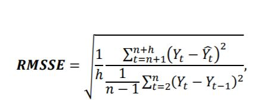

This is an [R Markdown](http://rmarkdown.rstudio.com) Notebook. When you execute code within the notebook, the results appear beneath the code. 

```{r}
source("models.R")

topLevel <- read.csv("TS_topLevel.csv",header = FALSE)
df_topLevel<- as.data.frame(topLevel)
names(df_topLevel) <- c("Date","Y")
calendar <- read.csv("calendar.csv",header = TRUE)
df_calendar<- as.data.frame(calendar)
df_calendar<-df_calendar[1:1913,]
df_topLevel_train<-head(df_topLevel, n=(nrow(df_topLevel)-28))
df_topLevel_test<-tail(df_topLevel, n=28)
```

La formuala della metrica della competition è l'RMSSE ottenuta modificando la funzione che calcolava la formula del MASE tramite la funzione:
```{r}
rmsse<-function(actual, predicted , step_size = 1){
  
  #Root Mean Squared Scaled Error (RMSSE),
  #which is a variant of the well-known Mean Absolute Scaled Error (MASE)
  
  naive_start <- step_size + 1
  n <- as.numeric(length(actual))
  naive_end <- n - step_size
  sum_errors <- sum((ae(actual, predicted))^2)
  naive_errors <- sum((ae(actual[naive_start:n], actual[1:naive_end]))^2)
  return( sqrt(sum_errors/(n * naive_errors/naive_end)) )
}
```

Basata sulla formula:


Inizio con le valutazioni dei modelli:

NOTA

* In tutti i modelli è stato utilizzato come parametro di **frequency il valore = 7**.
* Come finestra iniziale è stao scelto di utilizzare 1240 giorni (poco più di 3 anni) sui 1885 disponibili nel trianing, mentre il passo è di 28 giorni.
* Nella cross validation si sono ottenuti 24 split.
* Tutti i plot sono relativi all'ultima finestra temporale della procedura exapnding window.

## Seasonal naive
Il primo modello valutato è il fit seasonal naive
```{r}
list_of_frames <- expanding(df_topLevel_train, 1240, step=28) #1240=circa 3 anni e mezzo
results_snaive<-cross_validation(list_of_frames, horizon=28, frequency=7, fit_snaive, plot=TRUE)
```

```{r}
results_snaive$error
```
## ARIMA
Il secondo modello è l'ARIMA:
```{r}
# fit arima no xreg
results_arima<-cross_validation(list_of_frames, horizon=28, frequency=7, fit_arima, plot=TRUE)
```
```{r}
results_arima$error
```
## ETS
Il terzo modello è l'Exponential Smoothing (ETS)
```{r}
results_ets<-cross_validation(list_of_frames, horizon=28, frequency=7, fit_ets, plot=TRUE)
```
```{r}
results_ets$error
```
## NAR
Il quarto modello è il NAR (Non-linear autoregression model):
```{r}
results_nar<-cross_validation(list_of_frames, horizon=28, frequency=7, fit_nnetar, plot=TRUE)
```
```{r}
results_nar$error
```
## Modelli con variabili esterne
I modelli successivi utilizzano invece le variabili esterne, in questo caso in particolare sono state aggiunte le informazioni presenti in calendar.csv
```{r}
#ora i modelli con variabli esterne:
df_topLevel <- cbind(df_topLevel,df_calendar$wday,df_calendar$month,df_calendar$snap_CA,df_calendar$snap_TX,df_calendar$snap_WI)
df_topLevel_train<-head(df_topLevel, n=(nrow(df_topLevel)-28))
df_topLevel_test<-tail(df_topLevel, n=28)
df_topLevel_test
```
## NARX
Il primo modello è il NAR model with exogenous variables (NARX):
```{r}
list_of_frames <- expanding(df_topLevel_train, 1240, step=28) #1210=circa 3 anni e mezzo
results_narx<-cross_validation(list_of_frames, horizon=28, frequency=7, fit_nnetar_xreg, plot=TRUE)
```

```{r}
results_narx$error
```
##ARIMAX
Il secondo modello è l'ARIMA model with exogeneous variables (ARIMAX):
```{r}
results_arimax<-cross_validation(list_of_frames, horizon=28, frequency=7, fit_arima_errors, plot=TRUE)
```

```{r}
results_arimax$error
```
## Combinazione di modelli

Infine le combinazioni dei modelli più interessanti:

La prima combinazione è quella tra arima e neural network con xreg utilizzando la media:
```{r}
results_avg_arima_nar<-cross_validation(list_of_frames, horizon=28, frequency=7, fit_combination_xreg_average, plot=TRUE)
```

```{r}
results_avg_arima_nar$error
```
La seconda combinazione è quella tra arima e neural network con xreg utilizzando cls:
```{r}
results_cls_arima_nar<-cross_validation(list_of_frames, horizon=28, frequency=7, fit_combination_xreg_cls, plot=TRUE)
```

```{r}
results_cls_arima_nar$error
```
La terza combinazione è quella tra arima,neural network con xreg e ets utilizzando la media:
```{r}
results_avg_comb<-cross_validation(list_of_frames, horizon=28, frequency=7, fit_combination_average, plot=TRUE)
```

```{r}
results_avg_comb$error
```
Infine l'tultima combinazione è quella tra arima,neural network con xreg e ets utilizzando cls:
```{r}
results_cls_comb<-cross_validation(list_of_frames, horizon=28, frequency=7, fit_combination_cls, plot=TRUE)
```

```{r}
results_cls_comb$error
```

##Risultati

```{r}
models_name<-c("snaive","arima","ets","nar","narx","arimax","avg_arima_nar","cls_arima_nar","avg_comb","cls_comb")
errors<-rbind(results_snaive$error, 
                 results_arima$error,
                 results_ets$error,
                 results_nar$error,
                 results_narx$error,
                 results_arimax$error,
                 results_avg_arima_nar$error,
                 results_cls_arima_nar$error,
                 results_avg_comb$error,
                 results_avg_comb$error)
df_errors<-data.frame(models_name,errors)
df_errors
```

Confrontando i vari modelli, sulla metrica della competition (RMSSE), quello che ha ottenuto prestazioni migliori, in termini di valori medi di RMSSE, è il NAR model con variabili esterne.


